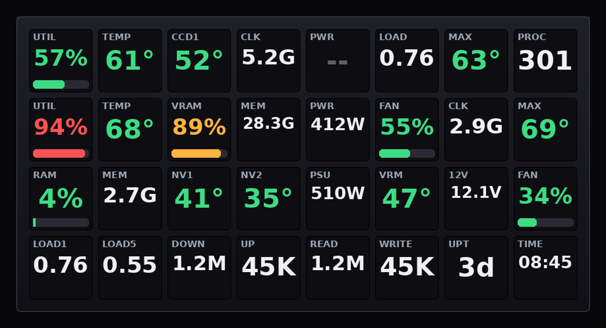

# Deck Stats — Stream Deck 8×4 dashboard



> Device mockup rendered by `deck_stats.py --preview`; shown values are simulated.

On-screen system monitoring for **Stream Deck XL** (32 addressable keys =
4 rows × 8 columns). No Elgato plugins required.

## Layout

```
ROW 0  CPU     UTIL | TEMP | CCD1 | CLK | PWR | LOAD | MAX | PROC
ROW 1  GPU     UTIL | TEMP | VRAM | MEM | PWR | FAN  | CLK | MAX
ROW 2  SYSTEM  RAM  | MEM  | NV1  | NV2 | PSU | VRM  | 12V | FAN
ROW 3  LINUX   LOAD1|LOAD5| DOWN | UP  |READ |WRITE | UPT | TIME
```

## Graphic rules

- 4–6 char label on top, small; large centered value
- Unit inside the value, not in the label: `45°` `66W` `3.7G` `2.8G`
- Colored bar **only** on UTIL, VRAM, RAM and FAN %
- Temperatures: white normal → yellow → red
- `--` = sensor unavailable at that moment

## Data sources

| Group | Sources |
|---|---|
| CPU | `psutil` (load), `k10temp` (Tctl/CCD1), RAPL (power), cpufreq (clock) |
| GPU | `nvidia-smi` (util, temp, VRAM, power, fan, clock) |
| System | `corsairpsu` hwmon (power, VRM, fan, 12V rail), NVMe hwmon, `psutil` (RAM) |
| Linux | `/proc/loadavg`, `/proc/net/dev`, `/proc/diskstats`, `psutil.pids()`, clock |

## Adaptations for this machine (MSI X870E + RTX 5090)

| Key | Intended | Actual on this machine |
|---|---|---|
| CPU PWR | CPU RAPL power | real RAPL if `energy_uj` is readable; otherwise fallback **PSU total − GPU** (rest of system) |
| CPU FAN | motherboard fan | **no fan sensor** on the MSI board → uses the PSU fan (pwm %) |
| CPU 12V | vcore | vcore not exposed → **PSU 12V rail** |
| GPU MAX | hotspot | hotspot not exposed by nvidia-smi → **rolling peak** of GPU temp |

## Installation

```bash
# Permissions (deck + readable RAPL) — requires sudo password
./install-udev.sh

# Run manually
.venv/bin/python deck_stats.py

# Or as a service on boot (already configured):
systemctl --user enable --now deck-stats
systemctl --user restart deck-stats
```

## Utilities

```bash
.venv/bin/python deck_stats.py --preview   # whole deck preview (8×4)
journalctl --user -u deck-stats -f         # live logs
```

## Notes

- Updates every 1.5 s; `nvidia-smi` costs ~50 ms per tick
- If RAPL still gives "Permission denied" (`-r--------`), re-run `./install-udev.sh`
- Rates (DOWN/UP/READ/WRITE) start from the second tick (the first one samples the baseline)
- If the deck is unplugged, the script reconnects automatically
